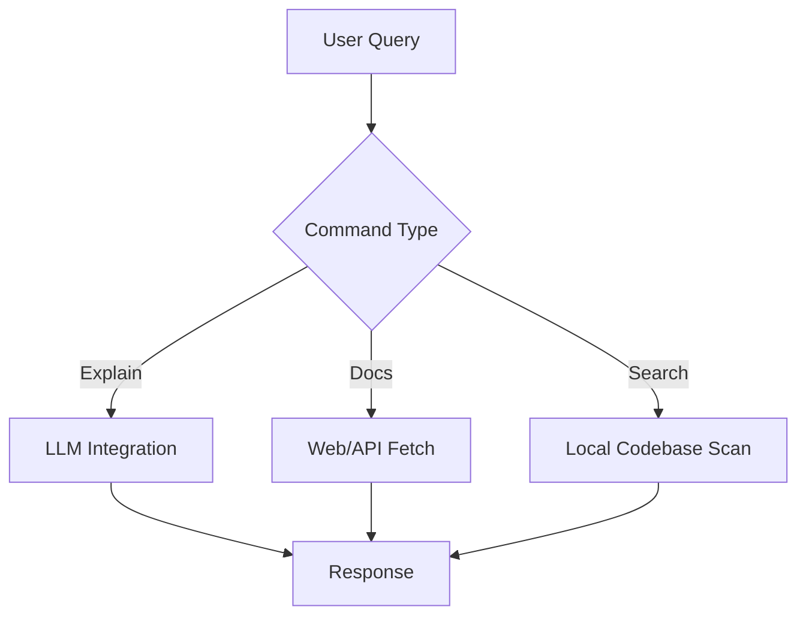

# DevAssist: Technical Architecture

## Overview
DevAssist is a CLI tool designed to streamline developer workflows using natural language commands. It integrates with local codebases, web resources, and APIs to provide contextual assistance.

## Architecture

### 1. Core Components
- **CLI Interface:** Built with `click` for intuitive command parsing.
- **Natural Language Processing:** Future integration with LLMs (e.g., Mistral, Llama) for query understanding.
- **Local Search:** Uses `ripgrep` (rg) for fast codebase searches.
- **Web Search:** Fetches Stack Overflow/GitHub issues via APIs or scraping.
- **Plugin System:** Modular design for extensibility (e.g., Docker, Kubernetes).

### 2. Data Flow

### 3. Why This Design?
- **Modularity:** Plugins allow users to extend functionality without bloating the core.
- **Performance:** `ripgrep` is faster than pure-Python alternatives for code search.
- **Accessibility:** CLI-first approach integrates seamlessly with developer workflows.

## Future Work
- **LLM Integration:** Add support for local/remote LLMs to explain errors and concepts.
- **IDE Plugins:** Extend to VS Code, PyCharm, and other IDEs.
- **Community Plugins:** Allow users to share custom commands.

## License
MIT